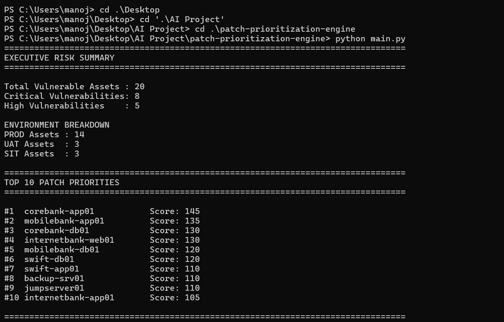
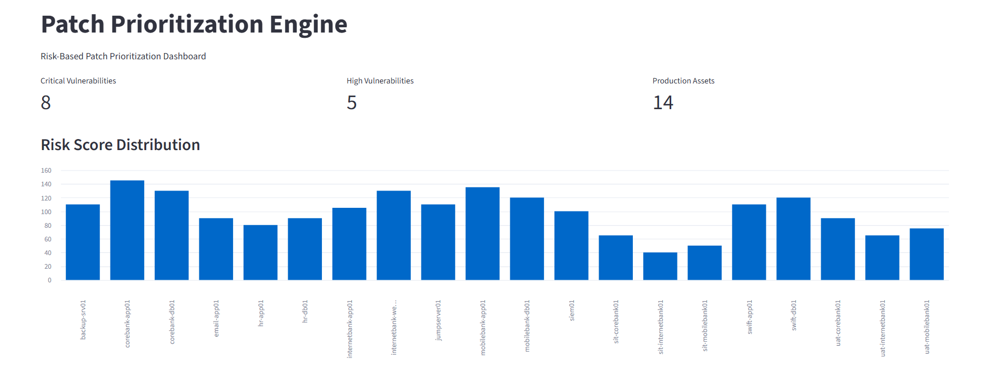
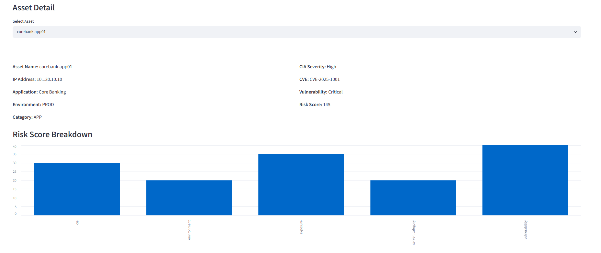
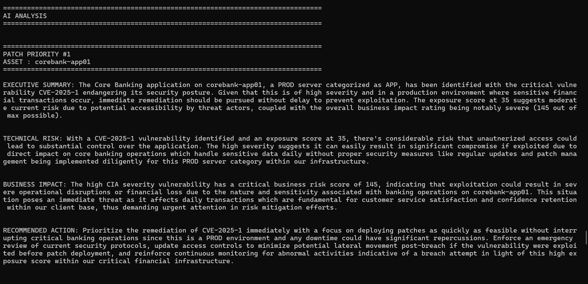
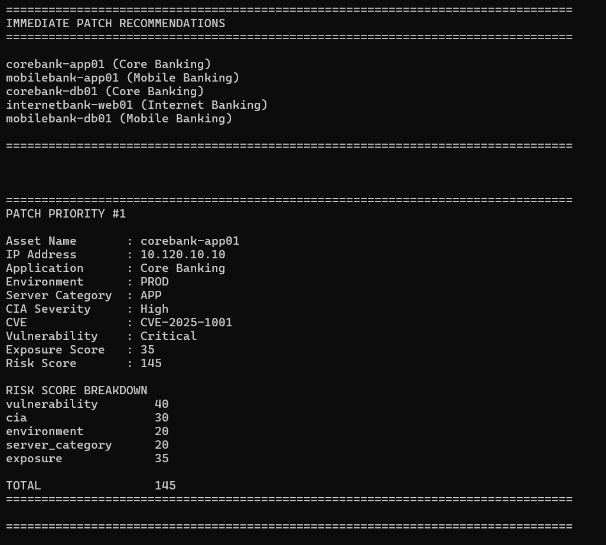

# AI-Assisted Patch Prioritization Engine

A security-focused exposure management and patch prioritization platform that combines vulnerability severity, asset criticality, exposure context, environment classification, and business impact to identify the most important systems to patch first.

The platform uses a deterministic rule-based scoring engine for risk calculations and a local LLM (Ollama + Phi3) for executive summaries, technical analysis, and remediation guidance.

---

## Project Overview

Traditional vulnerability management platforms often prioritize vulnerabilities solely based on CVSS scores.

This project demonstrates a more realistic enterprise approach by considering:

- Vulnerability Severity
- Asset Criticality
- Exposure Level
- Environment Type
- CIA Impact
- Business Context
- Patch Prioritization Logic

The output helps both technical teams and management understand:

- What should be patched first
- Why it is important
- Potential business impact
- Recommended remediation actions

## Architecture

!(screenshots/architecture.png)


---


## Features

### Risk-Based Patch Prioritization

- CVSS-Based Scoring
- Exposure-Aware Scoring
- Asset Criticality Evaluation
- Environment Weighting
- CIA Impact Assessment

### AI-Assisted Analysis

- Executive Risk Summary
- Technical Risk Analysis
- Business Impact Assessment
- Remediation Recommendations

### Reporting

- Interactive Streamlit Dashboard
- Excel Report Export
- PDF Report Export

### Explainable Risk Scoring

Every finding includes:

- Risk Score
- Risk Breakdown
- Business Impact
- AI Explanation

## Screenshots

### Executive Summary



Provides a management-level overview of overall risk posture, critical findings, and patching priorities.

---

### Streamlit Dashboard



Main dashboard showing risk metrics and prioritized findings.

---

### Risk Analysis Dashboard

.png)

Detailed AI-generated risk analysis and recommendations.

---

### Asset Analysis



Individual asset risk evaluation with score breakdown.

---

### AI Analysis



AI-generated executive and technical assessment.

---

### Summary Output



Executive reporting output generated by the AI layer.

## Project Structure

# Project Structure

```text
patch-prioritization-engine/

├── ai/
│   ├── ai_analysis.py
│   ├── ollama_client.py
│   └── prompt_builder.py
│
├── correlation/
│   ├── asset_context.py
│   ├── attack_path_analysis.py
│   └── exposure_analysis.py
│
├── dashboard/
│   └── app.py
│
├── data/
│   ├── asset_inventory.csv
│   ├── firewall_rules.csv
│   └── vulnerabilities.csv
│
├── ingestion/
│   ├── asset_loader.py
│   ├── firewall_loader.py
│   └── vulnerability_loader.py
│
├── prioritization/
│   └── patch_prioritizer.py
│
├── reporting/
│   ├── excel_export.py
│   ├── executive_report.py
│   ├── pdf_export.py
│   └── technical_report.py
│
├── scoring/
│   ├── risk_engine.py
│   └── scoring_weights.py
│
├── reports/
│
├── main.py
├── requirements.txt
└── README.md
```

---

## Risk Scoring Methodology

Risk scores are calculated using a deterministic scoring model.

Factors include:

| Factor | Weight |
|----------|----------|
| Vulnerability Severity | 40 |
| Exposure Level | 25 |
| Asset Criticality | 20 |
| Environment Type | 15 |

Final Risk Score = Sum of all contributing factors.

This ensures prioritization remains auditable and explainable.

## Example Risk Finding

Asset: WEB-PROD-01

Risk Score: 92

Factors:

- Critical Vulnerability
- Internet Facing
- Production Environment
- High CIA Impact

Recommendation:

Immediate patch deployment recommended.

## Technologies

- Python
- Streamlit
- Pandas
- OpenPyXL
- ReportLab
- Ollama
- Phi3

## Security Engineering Use Case

This project demonstrates how enterprise security teams can move beyond CVSS-only prioritization by incorporating asset context, exposure data, and business impact into patch management decisions.

The architecture follows modern Exposure Management principles and provides explainable, auditable risk prioritization suitable for security operations and vulnerability management programs.

## Author

Manoj Selvan G
manojselvang@gmail.com
github.com/manojselvang
https://www.linkedin.com/in/manojselvang/